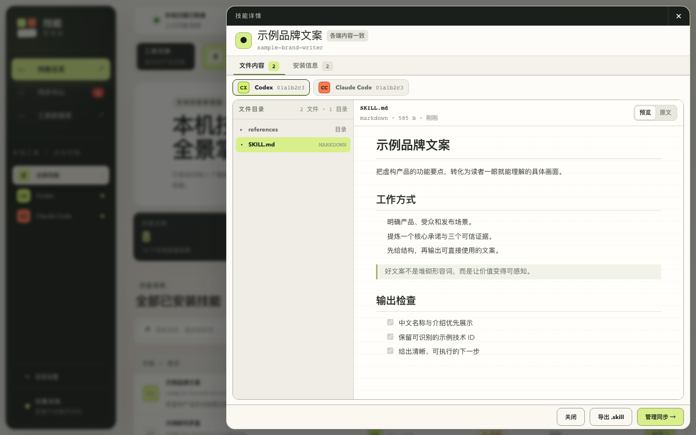

# Skill Control（技能管理器）

[简体中文](./README.md) · [English](./README_EN.md)

本地优先的 Agent Skill 可视化管理器。Skill Control 扫描你电脑上的
`SKILL.md` 技能目录，在一个界面中完成检索、详情预览、差异检查、跨工具同步，
以及 `.skill` 技能包的导入和导出。


> 当前版本：`v0.1.0` 首个公开版。源码和已经通过各目标平台冒烟测试的桌面产物
> 见 [Releases](../../releases)。

## 为什么需要 Skill Control

同一个 Skill 经常需要同时安装到 Codex、Claude Code 或其他 Agent 工具中。
手动复制目录很容易产生漏装、版本不一致和覆盖错误。Skill Control 以 Skill
名称聚合各处的本地安装，并在写入前展示计划：

- 哪些工具尚未安装；
- 同名 Skill 的内容是否一致；
- 本次操作会新增、替换还是跳过；
- 原版本会备份到哪里。

所有核心扫描和同步均在本机完成，不需要把 Skill 内容上传到远程服务。

## 功能

### 管理本地 Skills

- 扫描兼容 `SKILL.md` 的本地目录，并按 frontmatter `name` 聚合同名 Skill；
- 在 Agent 之间切换，查看各工具已安装的 Skills；
- 按名称、中文名称、介绍和标签搜索，并按状态筛选；
- 大型技能列表和同步任务列表采用渐进显示，避免首屏一次渲染全部条目；
- 显示安装覆盖、内容指纹、更新时间、文件数量、体积和软链接状态；
- 识别“已对齐”“覆盖不完整”“仅单端安装”和“版本冲突”；
- `SKILL.md` 存在中文名称或中文介绍时，优先显示中文信息。

### 查看与交换

- 浏览 Skill 文件树（超大目录会按安全上限截断），已安装 Skill 详情中的文件夹
  默认折叠；
- 默认选择 `SKILL.md`；
- Markdown 文件支持渲染预览和原始内容切换；
- 文本文件可直接预览，二进制文件只显示元数据；
- 从详情中使用系统文件管理器定位 Skill 目录；
- 把本地 Skill 导出为可移植的 `.skill` 文件；
- 拖放或选择 `.skill` 文件，先检查包结构和内容，再选择安装目标；
- `.skill` 导入预览同样支持文件夹折叠、Markdown 渲染和原文切换。



### 安全地同步

- 同步前生成新增、替换和跳过计划；
- 支持独立副本的“复制”模式；
- 支持一处修改、多端生效的“软链接”模式；
- 替换已有目录前自动备份；
- 只有在预览并明确确认后才会写入目标目录；
- 同步与导入记录只保存在本机。

Windows 创建目录软链接时可能需要启用“开发人员模式”或使用具备相应权限的账户；
不确定时建议使用默认的“复制”模式。

## 支持的 Agent 工具

内置目录规则如下。应用只会把本机检测到或由你手动配置的工具加入数据源。
默认技能列表仅展示 Codex 和 Claude Code，可以在“工具数据源”中修改。

| 工具 | 默认扫描目录 |
| --- | --- |
| Codex | `~/.codex/skills`、`~/.agents/skills`、`~/.codex/vendor_imports/skills` |
| Claude Code | `~/.claude/skills` |
| WorkBuddy | `~/.workbuddy/skills`、`~/.workbuddy/connectors/skills` |
| Cursor | `~/.cursor/skills` |
| Gemini CLI | `~/.gemini/skills` |
| Kiro | `~/.kiro/skills` |
| Trae | `~/.trae/skills` |
| OpenCode | `~/.config/opencode/skills`、`~/.opencode/skills` |
| Windsurf | `~/.windsurf/skills` |
| Cline | `~/.cline/skills` |
| Roo Code | `~/.roo/skills`、`~/.roo-code/skills` |
| CodeBuddy | `~/.codebuddy/skills` |
| Qwen Code | `~/.qwen/skills`、`~/.qwen-code/skills` |
| GitHub Copilot | `~/.copilot/skills`、`~/.github/copilot/skills` |

不在表中的工具也可以通过名称、简称、颜色和一个或多个 Skill 目录手动添加。

## 获取与运行

### 桌面版

`v0.1.0` 桌面版提供 macOS、Windows 和 Linux 安装产物。打包与签名状态以
[Releases](../../releases) 页面为准；没有对应平台产物时，请使用下面的源码方式。

| 你的系统 | 应选择的文件 |
| --- | --- |
| Apple Silicon Mac（M1/M2/M3/M4/M5…） | `Skill-Control-0.1.0-mac-arm64.dmg` |
| Intel Mac | `Skill-Control-0.1.0-mac-x64.dmg` |
| Windows x64 | 文件名含 `win-x64-setup`；免安装版含 `portable` |
| Linux x64 | `.AppImage` 或 `.deb` |

Apple Silicon 用户不要选择 `mac-x64`，否则 macOS 会把它当作 Intel 应用并显示
兼容性提示。首版尚未签名或公证，具体系统提示见 Release notes。

### 从源码运行

需要：

- Node.js `22.13.0` 或更高版本；
- npm；
- Git。

```bash
git clone https://github.com/zifeixu85/skill-control.git
cd skill-control
npm install
npm run dev
```

打开 [http://localhost:3000](http://localhost:3000)。`npm run dev` 会同时启动
界面和只监听 `127.0.0.1:43110` 的本地管理服务。

构建后运行：

```bash
npm run build
npm start
```

开发桌面壳：

```bash
npm run desktop:dev
```

这个命令会启动 Electron 开发窗口，并连接本机的开发界面和管理服务。桌面打包命令
列在 `package.json` 中；发布维护者应只在对应平台构建并验证产物。

## `.skill` 文件

Skill Control 使用 ZIP 容器作为 `.skill` 格式，包内必须包含一个
`SKILL.md`。Skill 可以位于压缩包根目录，也可以位于单一顶层文件夹中。

导入时会进行以下限制：

- 压缩包不超过 25 MB；
- 最多 1,500 个条目；
- 单个文件不超过 25 MB；
- 解压后总大小不超过 100 MB；
- 拒绝路径穿越和包含多个 Skill 根目录的包。

导入文件会先解压到本机预览区，不会因为选择文件而直接修改任何 Agent 目录。
导出沿用相同的单文件、总大小和条目上限；压缩结果超过 25 MB 时会停止，
避免把超大目录一次性载入桌面进程。

## 数据与隐私

配置、操作记录、导入预览和覆盖前备份位于：

```text
~/.agent-skill-manager/
├── config.json
├── history.jsonl
├── imports/
└── backups/
```

Skill Control 不包含遥测服务，也不会将 Skill 内容上传到项目维护者的服务器。
完整的数据范围、删除方式和网络边界见 [PRIVACY.md](./PRIVACY.md)。

## 开发

常用命令：

```bash
npm run dev      # 本地管理服务 + 开发界面
npm run build    # 构建界面
npm start        # 运行构建产物 + 本地管理服务
npm run desktop:dev # Electron 开发窗口
npm test         # 构建并运行 Node 测试
npm run lint     # ESLint
```

当前主要目录：

```text
app/                     React 界面
desktop/                 Electron 主进程、预加载脚本和开发启动器
server/local-server.mjs  本地扫描、文件预览、导入导出与同步服务
scripts/                 本地开发/运行编排
tests/                   本地服务和渲染测试
resources/               桌面图标与平台资源
worker/                  Web 构建入口
```

本地服务默认仅接受 `http://localhost:3000` 和 `http://127.0.0.1:3000`
来源的请求。开发时如需改变端口或来源，可使用：

```bash
SKILL_MANAGER_PORT=43110 \
SKILL_MANAGER_ORIGINS=http://localhost:3000 \
npm run manager
```

修改涉及文件写入、压缩包解析或路径解析的代码时，请先阅读
[CONTRIBUTING.md](./CONTRIBUTING.md) 中的安全约束。

## 路线图

- 应用签名、公证与安全的自动更新；
- 更细粒度的备份浏览与恢复；
- 可选 CLI，供自动化和高级用户使用；
- 可审计的 Agent 目录规则扩展机制。

路线图是方向说明，不代表相应能力已经在当前版本可用。

## 参与贡献

欢迎提交 Bug、交互改进、Agent 目录适配和安全修复：

- [贡献指南](./CONTRIBUTING.md)
- [行为准则](./CODE_OF_CONDUCT.md)
- [安全政策](./SECURITY.md)
- [第三方声明](./THIRD_PARTY_NOTICES.md)
- [版本记录](./CHANGELOG.md)
- [架构说明](./docs/ARCHITECTURE.md)
- [发布指南](./docs/RELEASING.md)
- [GitHub 仓库配置](./docs/REPOSITORY_SETUP.md)

## 许可证

本项目使用 [MIT License](./LICENSE)。
